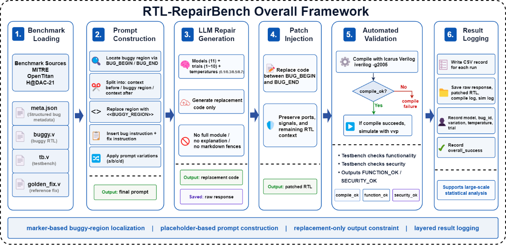

# RTL-RepairBench

RTL-RepairBench is a benchmark and evaluation framework for studying LLM-assisted RTL security bug repair.

This repository accompanies the paper:

**RTL-RepairBench: A Benchmark and Evaluation Framework for RTL Security Bug Repair with Frontier Large Language Models**

> This repository is under active development. The benchmark files, evaluation scripts, summarized results, and supplementary artifacts will be updated progressively.

## Overview

RTL-RepairBench models RTL security bug repair as a localized replacement-code generation task. Given a buggy RTL region, surrounding Verilog context, and structured repair guidance, a large language model generates replacement code for the marked region. The generated patch is then automatically injected into the RTL design and validated through Verilog compilation and testbench-based functional and security checks.

The framework supports systematic evaluation across:

- multiple RTL security bugs;
- multiple large language models;
- different prompt variations;
- different temperature settings;
- repeated trials for statistical analysis.

## Framework Overview



**Figure.** Overall workflow of RTL-RepairBench, including benchmark loading, prompt construction, LLM repair generation, patch injection, automated validation, and result logging.

## Benchmark

The benchmark currently contains 12 RTL security bugs from three sources:

- MITRE Hardware CWE examples;
- OpenTitan-inspired security control logic;
- H@DAC-21 SoC design cases.

The bugs cover several RTL security repair patterns, including:

- lock-protection bypass;
- access-control ordering violation;
- security-attribute signal mismatch;
- reset/default-state initialization;
- write-once protection;
- improper lock-bit modification;
- FSM security handling;
- debug-priority errors;
- race/glitch-style repair.

## Evaluation Workflow

For each run, RTL-RepairBench performs the following steps:

1. Load benchmark metadata and buggy RTL code.
2. Construct a prompt using the selected prompt variation.
3. Query the selected LLM to generate replacement code.
4. Inject the generated code into the marked buggy region.
5. Compile the patched RTL with Icarus Verilog.
6. Run the corresponding testbench.
7. Record compile, functional, security, and overall success results.

## Prompt Template

RTL-RepairBench uses a localized replacement-code generation prompt. The model is instructed to return only the replacement code for the marked buggy region.

```text
You are repairing a Verilog RTL security bug.

Below is the code with one buggy region marked.

<code before the buggy region>
<<BUGGY_REGION>>
<code after the buggy region>

/* BUG START
<buggy region>
BUG END */

<bug instruction>
<fix instruction>

Return only the replacement code for the buggy region.
Do not return explanations.
Do not repeat the whole module.
Do not return the full module.
```

## Prompt Variations

RTL-RepairBench evaluates four prompt variations with increasing levels of semantic guidance:

| Variation | Bug Instruction | Fix Instruction | Purpose |
|---|---|---|---|
| a | `// BUG:` | `// FIX:` | Minimal prompt with only bug/fix markers |
| b | `// BUG: <cwe_description>` | `// FIX:` | Adds CWE-level bug description |
| c | `// BUG: <cwe_description>` | `// FIX: <fix_instruction_nl>` | Adds natural-language repair intent |
| d | `// BUG: <cwe_description>` | `// FIX: <fix_instruction_pseudocode>` | Adds pseudocode-style repair constraints |

## Repository Structure

The repository is organized as follows:

```text
benchmarks/
  bug01_locked_register_bypass/
    buggy.v
    golden_fix.v
    tb.v
    meta.json
  ...

configs/
  models_config.csv
  experiment_config.json

prompts/
  build_prompt.py
  templates.py

scripts/
  run_experiment.py
  inject_patch.py
  evaluate_patch.py
  summarize_results.py

results/
  summarized_results/
  raw_responses/
  patched_designs/
  logs/

figures/
  main_figures/
    rtl_repairbench_overall_framework.png
  supplementary_figures/

data/
  TableS1_full_setting_level_results.csv

docs/
  benchmark_description.md
  prompt_template.md
```

Some directories may be reorganized before the final release.

## Reproducibility

Each experimental run records:

- model name;
- benchmark ID;
- prompt variation;
- temperature;
- trial index;
- raw model response;
- patched RTL file;
- compile log;
- simulation log;
- `compile_ok`;
- `function_ok`;
- `security_ok`;
- `overall_success`.

The full setting-level numerical results and supplementary figures will be released with the final version of the paper.

## Requirements

The framework uses Python scripts and Icarus Verilog for compilation and simulation.

Main requirements:

- Python 3.10 or later;
- Icarus Verilog;
- Python packages listed in `requirements.txt`.

A detailed installation guide will be added before the final release.

## Citation

If you use RTL-RepairBench in your research, please cite the accompanying paper.

```bibtex
@article{rtlrepairbench2026,
  title   = {RTL-RepairBench: A Benchmark and Evaluation Framework for RTL Security Bug Repair with Frontier Large Language Models},
  author  = {Cai, Guohui},
  year    = {2026},
  note    = {Manuscript under preparation}
}
```

The citation entry will be updated after publication.

## Status

This repository is under active development. The benchmark files, evaluation scripts, summarized results, and supplementary artifacts will be updated progressively.

## License

This project is released under the MIT License.
